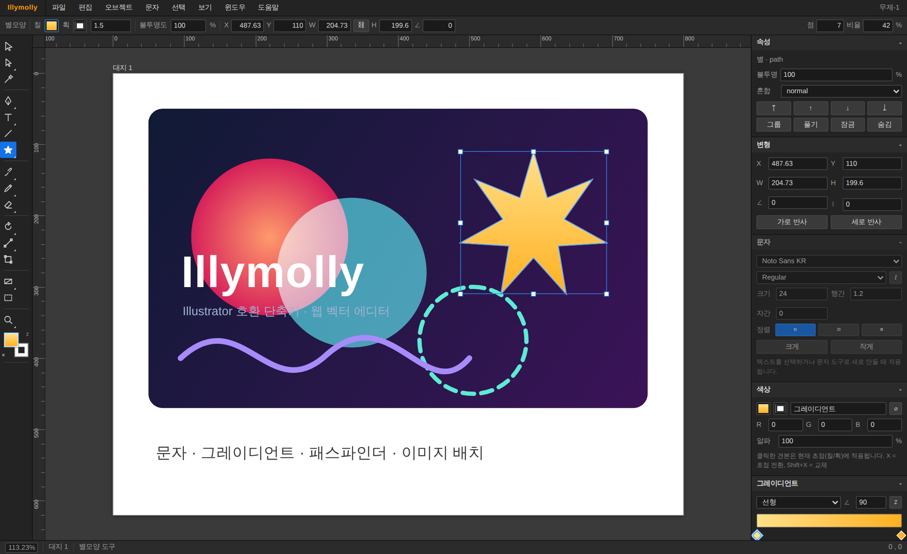

# Illymolly

Adobe Illustrator 와 **동일한 키 구조**로 동작하는 웹 기반 벡터 그래픽 편집기입니다.
빌드 도구 없이 순수 HTML/CSS/JavaScript 로 작성되어 있어 정적 서버에 그대로 올리면 동작합니다.



## 실행

```bash
# 아무 정적 서버나 사용 가능
npx http-server -p 8080 .
# 또는
python3 -m http.server 8080
```

브라우저에서 `http://localhost:8080/index.html` 을 엽니다.
(`file://` 로 직접 열어도 동작하지만, 파일 열기/내보내기는 서버 환경을 권장합니다.)

## 구현된 주요 기능

### 도구
- **선택 / 직접 선택 / 그룹 선택 / 자동 선택** — 클릭·Shift 추가선택·마퀴 선택, 그룹 격리(isolation) 모드
- **펜 도구** — 클릭(코너)·드래그(곡선), 패스 이어 그리기, 닫기, 고정점 추가/삭제/변환
- **도형** — 사각형, 둥근 사각형, 원, 다각형, 별, 선분 (라이브 셰이프 정보 유지)
- **문자 도구** — 캔버스 위 직접 편집(한글 IME 지원), 글꼴 크기·자간·행간·정렬
- **페인트브러시 / 연필 / 물방울 브러시** — 자유곡선 스무딩(RDP + Catmull-Rom), 폭·정밀도 조절
- **지우개** — 실제 도형 불리언 차집합으로 잘라냄
- **가위** — 패스 분할
- **회전 / 반사 / 크기 조절 / 기울이기 / 자유 변형** — 기준점 클릭 지정
- **도형 구성 도구(Shift+M)** — 겹친 영역을 가로질러 드래그하면 합쳐지고, `Alt` 드래그하면 지워짐
- **폭 도구(Shift+W)** — 패스 위의 한 지점을 잡아 끌면 그 자리의 획 두께가 바뀜
- **영역 문자 도구** — 닫힌 패스를 클릭하면 그 도형 안으로 글이 흘러 들어가고, 빈 곳을 드래그하면 문자 상자
- **패스 상 문자 도구** — 패스를 클릭하면 그 패스가 기준선이 되어 글자가 접선을 따라 섭니다.
  클릭한 지점이 곧 글의 시작 위치이고, 원본 패스는 일러스트레이터처럼 문자 오브젝트가 되면서 사라집니다.
  `문자 > 패스 상의 문자 옵션`에서 **문자 맞추기**(기준선·어센더·디센더·가운데) ·
  **시작 위치** · **뒤집기**를 조절하고, `패스 상의 문자 풀기`로 다시 패스로 되돌립니다.
  선택하면 기준선과 시작·끝 브래킷이 보이고, 넘치면 빨간 표시가 붙습니다.
  SVG 로는 그대로 대응되는 `<textPath>` 로, PDF 로는 글자마다 회전한 텍스트 행렬로 나갑니다
- **그레이디언트(주석자 포함) / 스포이드 / 대지 / 확대 / 손**

### Illustrator 재현 디테일
- **대화상자** — 모든 입력이 Illustrator 형태의 모달 (`prompt()` 미사용).
  새 문서(사전 설정·방향 연동), 문서 설정, 이동/회전/크기 조절/반사/기울이기,
  도형 크기, PNG 내보내기, 환경 설정. 변형 대화상자에는 **기준점 9분할 위젯,
  미리 보기 체크, 복사 버튼**이 Illustrator와 동일하게 들어 있습니다.
- **도구별 커서** — SVG 커서 세트. 펜 도구는 상태에 따라 `×`(새 패스) `+`(고정점 추가)
  `−`(고정점 삭제) `○`(패스 닫기) `/`(이어 그리기) 배지가 붙습니다.
  바운딩 박스 핸들은 방향에 맞춰 회전한 크기 조절·회전 커서가 나옵니다.
- **격리 모드** — 그룹 더블클릭 시 상단에 `‹ 레이어 › 그룹` 브레드크럼 바가 뜨고
  바깥 오브젝트가 흐려집니다. 브레드크럼 클릭으로 단계별 탈출.
- **고급 안내선** — 정렬 시 마젠타 안내선과 `중심 / 가장자리 / 대지 / 안내선` 라벨,
  대상과 이동 중인 오브젝트를 잇는 강조 구간. 선택 도구 호버 시 패스 하이라이트.
- **라이브 모퉁이 위젯** — 사각형 선택 시 모서리 안쪽에 나타나는 위젯을 끌어
  모퉁이 반경을 직접 조절 (반경 수치 HUD 표시).
- **획 정렬** — 가운데 / 안쪽 / 바깥쪽을 실제로 렌더링 (클리핑 기반, 픽셀 검증됨).
- **레이어 색상** — 레이어마다 고유 색이 배정되고 선택 표시(패스·바운딩 박스·앵커)가
  그 색을 따릅니다. 레이어 패널에는 타겟 원 `○`/`◉` 과 선택 사각형 열이 있습니다.
- **문서 단위** — pt / px / mm / cm / in. 변형 패널·눈금자·상태 표시줄에 모두 반영되며,
  `72pt` 처럼 단위를 직접 적으면 그 단위로 해석합니다 (눈금자 우클릭으로 변경).
- **기준점(reference point)** — 변형 패널의 3×3 위젯이 X/Y 표시 기준과
  W/H·회전·기울이기의 고정점을 결정합니다.
- **상황별 컨트롤 바** — 선택한 도구에 맞는 옵션이 오른쪽에 나타납니다.
- **탭 도크 패널** — 14개 패널이 6개 그룹으로 묶여 탭으로 전환됩니다.
  그룹 단위로 접을 수 있고, `윈도우` 메뉴에서 이름으로 꺼낼 수 있습니다
  (지금 앞에 나와 있는 패널에는 체크 표시).
- **아이콘 · 버튼 체계** — 패널의 모든 아이콘이 16px 격자 SVG 한 벌(`src/ui/icons.js`)에서
  나오고 색은 `currentColor` 만 씁니다. 덕분에 hover · 선택 · 비활성 상태에서
  아이콘이 자동으로 따라오고, OS 별 이모지 렌더 차이가 없습니다.
  버튼은 라벨형 · 아이콘형 · **세그먼트 그룹**(획 단면/모퉁이/정렬처럼 붙은 선택지) 세 가지이며,
  hover · 눌림 · 선택 · **비활성** · 키보드 포커스 링 상태를 모두 갖습니다.
  쓸 수 없는 명령의 버튼은 실제로 흐려집니다 (선택이 2개 미만이면 패스파인더가 꺼지는 식).
- **메뉴** — `편집 > 실행 취소 이동` 처럼 마지막 동작 이름이 메뉴에 표시됩니다.
- **대지 네비게이션** — 상태 표시줄의 `⏮ ◀ ▶ ⏭`, 대지 메뉴, `Alt+PageUp/Down`.

### 편집
- 실행 취소·다시 실행 (스냅샷 히스토리 150단계)
- 그룹/그룹 풀기, 정돈(맨 앞·앞·뒤·맨 뒤), 잠금/숨기기
- 클리핑 마스크, 컴파운드 패스
- 패스 연결(Join), 평균점 연결(Average)
- **패스파인더** — 합치기 / 앞면 제외 / 교차 / 교차 제외 / 나누기 / 자르기 / 병합 / 오리기 / 윤곽선 / 뒷면 제외
- 정렬 & 균등 배분 (선택 영역·대지·키 오브젝트 기준)
- 변형 패널 (X, Y, W, H, 각도, 기울기), 비율 고정
- **개별 변형(Transform Each, `Ctrl+Alt+Shift+D`)** — 선택한 오브젝트를
  각자의 기준점 기준으로 비율·이동·회전·반사. `임의` 옵션으로 오브젝트마다 다른 값 적용
- **이미지 자르기(Crop Image)** — 이미지 위에 도형을 얹고 함께 선택 → 도형 경계로 자름.
  원본 픽셀은 남고 표시 영역만 기록하므로 되돌릴 수 있고, SVG 로는 `clipPath` 로 나갑니다
- **패스 이동(오프셋)** — 바깥(양수) · 안쪽(음수). 자체 교차는 평면 분할 + 감김수로 정리하고,
  반지름보다 크게 줄이면 일러스트레이터처럼 결과가 사라집니다
- **단순화** — 곡선 정밀도 · 각도 한계값 · 곡선 맞춤, 앵커 수 미리 보기
- **블렌드(Ctrl+Alt+B)** — 두 오브젝트 사이 중간 단계. 형태 · 색 · 획 두께 · 불투명도를 함께 보간
- **심볼** — 아트웍을 심볼로 등록하면 인스턴스가 정의를 공유합니다.
  정의를 고치면 모든 인스턴스가 함께 바뀌고, `링크 끊기`로 실제 아트웍이 됩니다
- **아트웍 재색상화** — 쓰인 색을 모아 팔레트로 보여 주고, 색 치환 · 색조 회전 · 채도 · 밝기 조정
- **텍스트 윤곽선 만들기(Ctrl+Shift+O)** — 글자를 고배율로 래스터화한 뒤
  이미지 추적 엔진으로 벡터화합니다 (브라우저가 글리프 아웃라인을 주지 않기 때문)
- **이미지 추적(Image Trace)** — 래스터를 벡터 패스로. 흑백 로고·실루엣·라인 아트·스케치·
  3색 회색 음영·3/6/16색·저/고충실도 사진 등 Illustrator 사전 설정에 대응.
  마칭 스퀘어 등고선 + 중앙값 분할 색 양자화 + RDP 단순화 + 곡선 맞춤, 미리 보기 지원

### 스타일
- 칠/획 페인트: 없음 / 단색 / 선형·방사형 그레이디언트
- HSB 색상 피커, 견본 팔레트, RGB·HEX·알파 입력
- **그레이디언트 패널** — 정지점 추가·이동·삭제·반전, 정지점별 색상/불투명도, 유형·각도
- **문자 패널** — 글꼴, 두께, 기울임, 크기, 행간, 자간, 정렬
- 획: 두께, 단면(cap), 모퉁이(join), 정렬(가운데·안쪽·바깥쪽), 점선(dash)
- **획 화살표** — 시작/끝 각각 없음·화살표·삼각형·원·사각형·막대, 비율(%), 뒤바꾸기.
  열린 패스의 끝점에만 붙고 SVG 로는 `<marker>` 로 나갑니다
- **모양(Appearance) 패널** — 한 오브젝트에 칠과 획을 **여러 겹**. 겹 순서 변경,
  겹 단위 색 편집, `모양 확장`으로 각 겹을 실제 오브젝트로 펼치기.
  겹이 기본 구성(칠 1 + 획 1)으로 돌아오면 스택이 자동으로 정리됩니다
- **가변 폭 프로파일** — 균일 / 한쪽 가늘게 / 양쪽 가늘게 / 가운데 굵게 / 물결,
  또는 폭 도구로 직접. SVG 로는 리본 모양 윤곽으로 나갑니다
- **서예 브러시** — 펜촉 각도와 납작함으로 진행 방향에 따라 두께가 변합니다
- **산포 브러시** — 아트웍을 패스를 따라 뿌립니다 (크기 · 회전 · 간격 변화)
- **패턴 칠** — 선택 아트웍을 타일로 등록해 칠·획에 사용. 비율·각도 조절, SVG `<pattern>` 출력
- **불투명도 마스크** — 맨 앞 오브젝트의 **밝기**가 곧 불투명도. 반전 지원, SVG `<mask>` 출력
- **효과(비파괴)** — `효과 > 흐림 효과 > 가우시안 흐림`,
  `효과 > 스타일화 > 그림자 만들기 / 외부 광선`. 원본 패스는 그대로 남고
  `효과 (모양)` 패널에서 다시 편집·삭제할 수 있습니다.
  미리보기 경계에는 반영되지만 기하 경계는 바뀌지 않으며,
  SVG 로는 `feGaussianBlur` / `feDropShadow` 필터로 나갑니다.
  `Ctrl+Shift+E` 로 마지막 효과를 반복 적용합니다
- **효과 > 왜곡 및 변형(벡터 효과)** — `지그재그` · `거칠게 하기` · `오목· 볼록` ·
  `비틀기` · `변형` · `자유 왜곡`. 래스터 필터가 아니라 **기하 자체**를 바꾸는
  효과라 확대해도 선명하고, SVG · PDF 로도 벡터 그대로 나갑니다.
  원본 패스는 건드리지 않으므로 직접 선택 도구에는 **원래 앵커**가 보이고,
  값은 언제든 다시 편집하거나 `모양 확장`으로 실제 패스로 굳힐 수 있습니다.
  `변형`은 사본을 만들 수 있어 한 오브젝트가 여러 벌로 반복됩니다.
  선택·히트 판정과 바운딩도 변형된 모양을 따릅니다.
  `거칠게 하기`의 난수는 시드 기반이라 프레임마다 모양이 떨리지 않습니다
- 불투명도, 혼합 모드(blend mode)
- **상황별 컨트롤 바** — 선택한 도구에 맞는 옵션(모퉁이 반경, 별 점 개수·비율,
  브러시/지우개 폭, 연필 정밀도, 글꼴·크기, 확대 프리셋, 대지 사전 설정) 노출

### 캔버스 & 문서
- **다중 문서 탭** — 여러 문서를 한 창에서 탭으로 열어 둡니다.
  문서마다 **실행 취소 스택 · 화면 위치와 배율 · 선택 · 격리 모드 · 수정 표시**가 따로 유지되고,
  `Ctrl+N`(새로 만들기) · `Ctrl+O`(열기)는 새 탭으로, `Ctrl+W`는 탭을 닫습니다
  (`Ctrl+Tab` / `Ctrl+Shift+Tab` 으로 순환). 문서가 하나면 탭 줄은 저절로 숨습니다.
  탭의 `•` 는 저장되지 않은 변경이고, 마지막 문서를 닫으면 빈 새 문서가 대신 열립니다
- 대지(artboard) 다중 지원, 대지 도구로 생성·이동
- **대지 패널** — 목록·클릭 이동·더블클릭 옵션, 추가/복제/삭제,
  `대지를 선택 항목에 맞추기(Ctrl+Alt+C)` · `아트웍에 맞추기` · `모두 재정렬`
- 눈금자, 안내선(눈금자 드래그 생성), 격자, 격자에 물리기
- **안내선** — 잠금 토글(`Ctrl+Alt+;`, 기본 잠김), 잠금이 풀리면 캔버스에서 직접 끌어
  옮기고 밖으로 빼서 삭제, `안내선 해제(Ctrl+Alt+5)` 로 선 오브젝트 변환
- **고급 안내선(스마트 가이드)** — 다른 오브젝트/대지의 모서리·중심에 스냅
- 윤곽선 보기(Ctrl+Y), 가장자리 숨기기(Ctrl+H)
- 레이어 패널 — 계층 트리, 표시/잠금, 이름 변경, 드래그 순서 변경
- **레이어 구성** — 선택 항목을 새 레이어로 모으기, 레이어로 배포(순차),
  Ctrl/Shift 클릭으로 고른 **레이어만 부분 병합**, 하위 레이어, 드래그로 그룹 안에 넣기
- **눈금자 원점** — 눈금자 코너에서 끌어 0 위치를 옮기고 더블클릭으로 초기화
- **화면 회전** — 두 손가락 비틀기 또는 `보기 > 화면 회전`, `Shift+Ctrl+1` 로 초기화

### 파일
- 저장/열기: `.illy.json` (문서 전체 보존)
- **이미지 배치(Place, `Ctrl+Shift+P`)** — PNG/JPEG/GIF/WebP/SVG 를 문서에 삽입,
  변형·클리핑·저장·SVG 내보내기 모두 지원
- 가져오기: `.svg` (path/rect/circle/ellipse/line/polygon/image/text/group, transform 포함).
  최상위 `<g id="...">` 는 레이어로 매핑되어 자체 SVG 왕복이 무손실에 가깝습니다.
- 내보내기: `.svg`, `.png` (배율 지정), **`.pdf` (벡터)**
  — 외부 라이브러리 없이 PDF 1.4 를 직접 씁니다. 패스 · 색 · 불투명도 · 클리핑은 벡터,
  이미지는 DCTDecode XObject, 텍스트는 표준 14 글꼴.
  한글은 표준 글꼴에 없어 `?` 로 대체되므로 먼저 `윤곽선 만들기`를 권합니다

### 성능
아이템 2000개 문서 기준 (Chromium, 1440×900):

| 작업 | 소요 |
|---|---|
| 전체 렌더 1프레임 | ~15 ms |
| 히트 테스트(마우스 이동 1회) | ~1.6 ms |
| 마퀴 선택 검색 | ~3.4 ms |
| 스마트 가이드 스냅 타깃 수집 | ~3.0 ms |

히트 테스트·마퀴·스냅은 변환 행렬을 트리 하향으로 누적하고 화면 바운딩으로 먼저
걸러 O(n) 로 동작합니다.

## 모바일 · 터치

데스크톱 UI 를 줄인 것이 아니라 한 손 조작을 전제로 다시 설계했습니다.
수치는 모두 근거 문헌·표준에서 가져왔고 테스트로 실측합니다.

| | |
|---|---|
| **터치 타깃** | 최소 44px, 주 컨트롤 48px — 한 손 엄지 연구의 9.2mm(≈35px)와 Apple 44pt / Material 48dp 를 모두 상회 |
| **엄지 영역** | 도구 독·선택 컨텍스트 바를 하단에. 한 손 조작 49% 관찰 결과 반영. 왼손잡이 전환 제공 |
| **마킹 메뉴** | 도구 슬롯 길게 누르기 → 방사형 메뉴. 메뉴가 뜨기 전 방향으로 그으면 바로 선택 |
| **루페** | 정밀 드래그 중 손가락에 가려진 곳을 위쪽에 2배 확대 + 십자선 |
| **제스처** | 두 손가락 = 이동·확대·**회전**(항상) · 두 손가락 탭 = 실행 취소 · 세 손가락 탭 = 다시 실행 |
| **필압** | 스타일러스 필압을 브러시·물방울 브러시 두께에 반영 (`Touch.force` / `PointerEvent.pressure`) |
| **패널** | 데스크톱 패널 DOM 을 바텀 시트로 옮겨 재사용 — 모바일 전용 UI 코드 없음 |

설계 근거와 문헌은 **[docs/MOBILE-UX.md](docs/MOBILE-UX.md)** 에 정리했습니다.

## AI 에이전트용 자동화 API

사람이 GUI 로 쓰는 것과 **같은 문서 · 같은 실행 취소 스택**을 코드로 조종할 수 있습니다.
브라우저에서는 `window.illy`, Node 에서는 `require('illymolly')` — API 는 동일합니다.

```js
// 브라우저 (GUI 와 함께) — 캔버스·패널·레이어가 즉시 갱신되고 Ctrl+Z 로 되돌릴 수 있습니다
illy.addRect({ x: 20, y: 20, width: 200, height: 120, fill: '#ff3366' });
illy.find({ fill: 'red' });          // 선택자로 대상 특정
console.log(illy.describe());        // 픽셀 없이 상태 파악
```

```js
// Node (헤드리스 · 브라우저 불필요)
const { createDocument } = require('illymolly');
const illy = createDocument({ width: 400, height: 300 });
illy.addText({ x: 24, y: 160, text: 'Illymolly', size: 40 });
require('fs').writeFileSync('out.svg', illy.toSVG());
```

```bash
illy run script.js -o out.svg   # CLI
illy ops --json                 # LLM 함수 정의로 쓸 도구 매니페스트
illy info doc.illy.json         # 구조 요약
```

iframe 으로 임베드하면 `postMessage` RPC 로 창 밖에서 제어할 수 있습니다.

**에이전트를 염두에 둔 설계**

- 모든 인자·반환값이 JSON 직렬화 가능 — RPC 를 그대로 통과
- 결정적 id (`path-3`) — 같은 스크립트는 같은 결과
- 연산 정의가 한 곳 — 호출 메서드와 `illy.ops()` 매니페스트가 같은 테이블에서 생성되어 문서와 구현이 어긋나지 않음
- `undoable` 선언 강제 — 조회 연산이 실행 취소 스택을 오염시키는 사고를 로드 시점에 차단
- 원자적 `batch()` — 하나라도 실패하면 전부 롤백하고 실패 지점을 알려 줌. 전체가 실행 취소 한 단계
- 오타 인자를 조용히 무시하지 않고 사용 가능한 이름을 안내
- `describe()` — 화면을 볼 수 없는 에이전트를 위한 텍스트 요약

전체 레퍼런스: **[docs/AI-API.md](docs/AI-API.md)**

## 테스트

네 개의 스위트가 있습니다.

| 스크립트 | 내용 |
|---|---|
| `npm test` | E2E 78개 — 실제 마우스/키보드 조작으로 도구·단축키·대화상자·패널·커서·API·RPC 검증 |
| `npm run test:deep` | 심층 107개 — 기하/모델/불리언 연산의 수학적 불변식을 직접 검증 |
| `npm run test:api` | 자동화 API 38개 — 헤드리스 Node, 브라우저 불필요 |
| `npm run test:mobile` | 모바일 17개 — 실제 TouchEvent 로 제스처·마킹 메뉴·타깃 크기 실측 |

```bash
npm run test:api                  # Playwright 없이 바로 실행 가능
npm i -D playwright && npx playwright install chromium
npm run test:all                  # 240개 전부
```

심층 스위트는 원∩원 넓이를 해석해와 비교하고, 그룹 변환 왕복·다단계 undo/redo 동일성·
JSON/SVG 왕복·2000개 오브젝트 성능 한계까지 확인합니다.
E2E 스위트는 획 정렬 3종과 격리 모드 흐리게 처리를 **픽셀 단위로** 확인하고,
대화상자의 사전 설정 연동·미리 보기·복사 버튼, 단위 변환, 커서 고유성까지 검증합니다.
UI 구조도 테스트가 지킵니다 — 탭 도크가 그룹마다 정확히 하나만 보이는지,
선택 개수에 따라 버튼이 실제로 비활성이 되는지, 그리고 **패널에 글리프 버튼이 남아 있지 않은지**
(모든 아이콘이 SVG 한 벌에서 나오는지)를 매번 확인합니다.

## 단축키

Illustrator 기본 단축키를 그대로 사용합니다. 전체 목록은 **[docs/SHORTCUTS.md](docs/SHORTCUTS.md)** 를 참고하세요.

키 인식은 `KeyboardEvent.code`(물리적 키 위치) 기반이라 **한글 입력 상태에서도 단축키가 동작**하며,
macOS 에서는 `Ctrl` 이 자동으로 `⌘` 로 매핑됩니다.

## 코드 구조

```
index.html            UI 레이아웃
css/app.css           Illustrator 스타일 다크 테마
css/mobile.css        터치 · 좁은 화면 레이아웃
src/
  util.js             수학 · 2×3 행렬 · 사각형 · DOM 헬퍼
  color.js            색 변환 · 페인트(칠/획) 정의
  model.js            문서 · 레이어 · 아이템 데이터 모델
  geom.js             베지어 · 패스 기하 · 평탄화 · 스무딩
  pathfinder.js       폴리곤 불리언 · 평면 분할(면 추출)
  history.js          실행 취소 스택
  appearance.js       모양 스택 (칠 · 획 여러 겹)
  assets.js           심볼 · 패턴 (문서에 저장되는 재사용 자산)
  distort.js          왜곡 및 변형 (지그재그 · 거칠게 · 오목볼록 · 비틀기 · 변형 · 자유 왜곡)
  effects.js          비파괴 효과 (흐림 · 그림자 · 광선)
  render.js           캔버스 렌더러 (아트워크 + 효과 합성 + 화살표 + 선택 UI)
  hit.js              히트 테스트 + 선택 상태
  view.js             화면↔문서 좌표 · 줌 · 눈금자
  edit.js             변형 · 정렬 · 순서 · 패스파인더 · 개별 변형 · 크롭 · 레이어 · 대지 · 안내선
  docs.js             다중 문서 (문서마다 실행 취소 · 화면 · 선택을 따로 보관)
  trace.js            이미지 추적 · 텍스트 윤곽선 (마칭 스퀘어 · 색 양자화 · 곡선 맞춤)
  pdf.js              벡터 PDF 출력 (외부 라이브러리 없음)
  tools/              도구 구현 (base, select, directselect, pen, shape, type,
                      freehand, transformtools, shapebuilder, width, misc, index)
  commands.js         명령 레지스트리 (메뉴 + 단축키 공용)
  keymap.js           Illustrator 호환 키 매핑
  ui/                 메뉴 · 패널 · 대화상자 · 레이어 · 색상 피커 · 아이콘 팩(icons.js)
  io.js               저장/열기/SVG·PNG 입출력
  mobile.js           모바일 셸 (앱바 · 도구 독 · 바텀 시트 · 마킹 메뉴)
  api.js              자동화 API (연산 테이블 · 선택자 · 배치)
  bridge.js           postMessage RPC 브리지
  app.js              부트스트랩 · 이벤트 라우팅 · 렌더 루프
index.js              Node 진입점 (헤드리스)
bin/illy.js           CLI
```

`src/util.js` 부터 `src/api.js` 까지의 코어는 DOM 없이도 동작합니다.
Node 진입점은 **브라우저와 같은 소스 파일을 그대로 읽어 실행**하므로
빌드 단계도, 코드 사본도 없습니다.

전역 네임스페이스는 `window.AI` 하나입니다. 콘솔에서 `AI.app` 으로 현재 상태에 접근할 수 있습니다.

## 알려진 제한

- 패스파인더와 지우개는 곡선을 **평탄화(0.2px 허용오차)** 한 뒤 계산하므로 결과가 폴리곤 근사입니다.
  (원∩원 면적 오차는 0.05% 수준)
- 나누기/자르기는 구멍이 있는 컴파운드 패스를 조각낼 때 구멍 정보를 잃을 수 있습니다.
- 래스터 효과(가우시안 흐림 · 그림자 만들기 · 외부 광선)는 `모양 확장`으로
  벡터화되지 않습니다 (확장을 시도하면 그렇게 안내합니다).
  벡터 효과인 `왜곡 및 변형`은 확장하면 실제 패스가 됩니다.
- `왜곡 및 변형`은 패스에만 적용됩니다 (문자 · 이미지 · 그룹은 대상이 아닙니다).
- 브러시는 서예 · 산포 두 가지입니다 (아트 · 패턴 · 강모 브러시는 미구현).
- 그물망(Mesh) · 퍼펫 뒤틀기 · 원근 격자 · 자유형 그레이디언트는 미구현입니다.
- PDF 는 내보내기만 지원합니다 (가져오기, AI · EPS 는 미지원).
  그레이디언트와 패턴은 PDF 셰이딩 대신 대표색으로 근사합니다.
- 텍스트 윤곽선은 글리프 아웃라인이 아니라 고배율 래스터를 추적한 결과라
  아주 작은 글자에서는 곡선이 약간 뭉툭해질 수 있습니다.
- 모양 스택의 여러 겹은 SVG 에 대응이 없어 같은 패스를 겹쳐 내보냅니다.
- 이미지 추적은 내부적으로 긴 변 640px 로 축소해 계산하므로 아주 미세한 디테일은 사라집니다.
- 자동화 API 에서 `toPNG`·`setTool`·`zoom` 은 브라우저 전용이며,
  Node 에서는 캔버스가 없어 텍스트 바운딩이 근사치입니다.
- 그레이디언트는 기본적으로 바운딩 박스에 매핑되고, 그레이디언트 도구로 캔버스에서 방향을 그리면
  그 오브젝트만의 시작 · 끝점을 갖습니다. 다만 **자유형 그레이디언트**는 미구현입니다.
- 획 안쪽/바깥쪽 정렬은 클리핑으로 구현해 가장자리와 모퉁이는 정확하지만,
  점선의 둥근 끝(round cap)은 사각 끝으로 대체됩니다.
- SVG 는 획 정렬 속성이 없어 내보내기 시 가운데 정렬로 저장됩니다.
